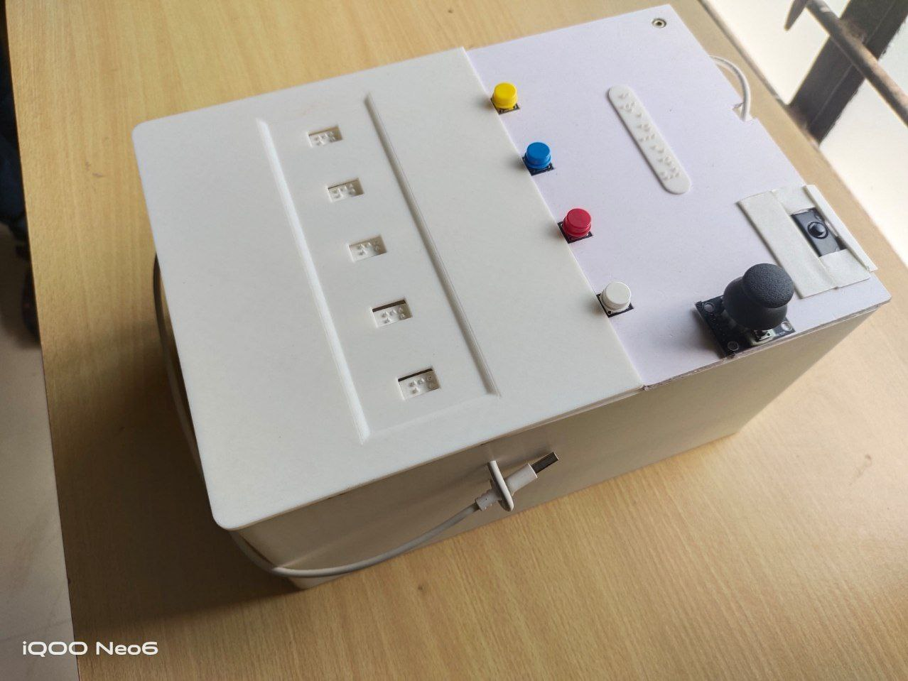

<p align="center">
  
</p>
 
# **Brailify: Voice to Refreshable Braille Display**

## **Project Overview**  
Brailify is a project that converts voice input into a refreshable Braille display, providing a cost-effective speech-to-Braille device. The system uses a combination of Python scripts and an Arduino to process voice input, convert it to text, and then display the corresponding Braille characters using stepper motors.

## **Project Structure**

### **Files**

### **1. `brailify_firmware.py`**  
- **Description**: This script acts as the firmware for Brailify, handling all major functionalities, including:  
  - **File Application**:  
    - Recording and saving transcriptions.  
    - Deleting files.  
    - Navigating stored files.  
  - **File Format**: Each file is stored as a JSON object with the format `{ "0": "..." }`.  
  - **Telegram Integration**:  
    - Fetches messages from a Telegram bot.  
    - Allows anyone to send messages to the Brailify user.  
    - The Brailify user can send replies as voice messages.  
  - **User Inputs & Outputs**:  
    - Handles push buttons for navigation.  
    - Controls buzzer and vibration motor for feedback.  

### **2. `braille_series.ino`**  
- **Description**: The Arduino code responsible for controlling the stepper motors and joystick.  
  - **Braille Display Mapping**:  
    - Implements a **5-window string-to-motor-step mapping** system for displaying Braille characters.  
  - **Joystick Control**:  
    - Allows users to navigate through transcriptions using the PS2 joystick module.  

## **Running script in background**
- **Using systemd manager** : create `active.service` file and add configuration for running the `active.py` script in the background.
```sh
sudo systemctl daemon-reload
sudo systemctl start active.service
sudo systemctl status active.service
